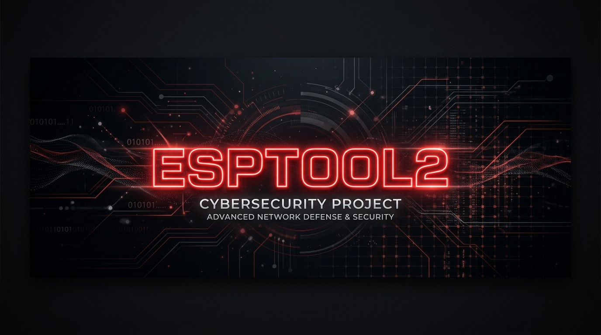

```text
 _____ ____  ____ _____ ___   ___  _     ____  
| ____/ ___||  _ \_   _/ _ \ / _ \| |   |___ \ 
|  _| \___ \| |_) || || | | | | | | |     __) |
| |___ ___) |  __/ | || |_| | |_| | |___ / __/ 
|_____|____/|_|    |_| \___/ \___/|_____|_____|
```

 # ESPTOOL2 — Multi-band Wireless Toolkit

[](https://opensource.org/licenses/MIT)
[](https://github.com/ipv4shh/ESPTOOL2/stargazers)
[](https://github.com/ipv4shh/ESPTOOL2)




> [!IMPORTANT]
> **Для новичков:** Специально для тех, кто впервые работает с платами ESP32, написана подробная [пошаговая инструкция для чайников](INSTRUCTIONS.md). Рекомендуется начать с неё!

**ESPTOOL2** — это открытый программно-аппаратный комплекс для исследования беспроводных сетей. Построен на базе ESP32-S3 и поддерживает широкий спектр атак и сканирования в диапазоне 2.4 ГГц.

Этот репозиторий научит вас сделать из двух ESP32 настоящий универсальный инструмент без особых вложений. Работает по связке распределения нагрузки между ESP и телефоном.

---

## 📡 Возможности

Проект основан на [ESP32-DIV](https://github.com/cifertech/ESP32-DIV) от CiferTech.

### Wi-Fi
- **Beacon Spam** — массовая рассылка фейковых SSID
- **Deauth Attack** — принудительное отключение клиентов
- **Probe Flood** — нагрузочное тестирование точек доступа
- **Wi-Fi Scanner** — обнаружение сетей с детальной информацией
- **Evil Twin** — клонирование сети с поддельной страницей входа

### Bluetooth (BLE)
- **BLE Scanner** — обнаружение BLE-устройств
- **BLE Spoofer** — эмуляция BLE-маяков
- **BLE Jammer** — подавление BLE-сигнала
- **Sour Apple** — эмуляция Apple-уведомлений (AirDrop)

### 2.4 GHz
- **2.4GHz Scanner** — анализ спектра (128 каналов)
- **Protokill** — подавление Zigbee и пользовательских протоколов

### Sub-GHz (требуется CC1101)
- **Replay Attack** — захват и воспроизведение сигналов
- **Sub-GHz Jammer** — подавление Sub-GHz связи

### Infrared (требуется IR-диод)
- **IR Replay** — захват и воспроизведение IR-команд

---

## 🧠 Доработки (в планах)
- [ ] Wi-Fi Channel Hopper — переключение каналов для обхода обнаружения
- [ ] BLE Connection Flood — нагрузочное тестирование BLE-устройств
- [ ] Sub-GHz Scanner — сканирование Sub-GHz частот
- [ ] IR Universal Remote — управление техникой из базы команд

---

## 🛠️ Требуемое оборудование

| Компонент | Назначение |
| :--- | :--- |
| **ESP32-S3** | Основной микроконтроллер |
| **ESP32 (опционально)** | Вспомогательный модуль |
| **Внешняя антенна 2.4 ГГц** | Увеличение дальности |
| **CC1101** | Sub-GHz (опционально) |
| **NRF24L01** | 2.4 ГГц (опционально) |
| **IR-диод** | Инфракрасный (опционально) |

---

## 📡 Архитектура и принцип работы

Проект построен по принципу распределения нагрузки:

```text
┌─────────────────────────────────────────────────────────────┐
│                           ТЕЛЕФОН                           │
│                   (браузер, 192.168.4.1)                    │
└──────────────────────────┬──────────────────────────────────┘
                           │ Wi-Fi
                           ▼
┌─────────────────────────────────────────────────────────────┐
│                    ESP32 DevKit (MASTER)                    │
│ ┌─────────────────────────────────────────────────────┐ │
│ │ • Точка доступа Wi-Fi (ESP-Admin)                   │ │
│ │ • Веб-сервер (HTTP, HTML, CSS, JS)                  │ │
│ │ • Приём команд из браузера                          │ │
│ │ • Передача команд по ESP-NOW на Slave               │ │
│ └─────────────────────────────────────────────────────┘ │
└──────────────────────────┬──────────────────────────────────┘
                           │ ESP-NOW (беспроводная связь)
                           ▼
┌─────────────────────────────────────────────────────────────┐
│                       ESP32-S3 (SLAVE)                      │
│ ┌─────────────────────────────────────────────────────┐ │
│ │ • Получение команд по ESP-NOW                       │ │
│ │ • Запуск атак:                                      │ │
│ │   - Beacon Spam (фейковые SSID)                     │ │
│ │   - Deauth Attack (отключение клиентов)             │ │
│ │   - BLE Jammer / Spoofer                            │ │
│ │   - Sub-GHz Replay / Jammer (CC1101)                │ │
│ │   - IR Replay (IR-диод)                             │ │
│ │ • Отправка статуса обратно (опционально)            │ │
│ └─────────────────────────────────────────────────────┘ │
└─────────────────────────────────────────────────────────────┘
```


### Как это работает:

1. **Телефон** подключается к Wi-Fi сети ESP32 DevKit (Master) (`ESP-Admin`).
2. В браузере открывается веб-интерфейс (`192.168.4.1`).
3. Выбирается атака → нажатие кнопки отправляет HTTP-запрос на Master.
4. **ESP32 DevKit (Master)** получает команду и передаёт её по **ESP-NOW** на Slave.
5. **ESP32-S3 (Slave)** запускает выбранную атаку.
6. Статус возвращается на Master и отображается в интерфейсе.

---

## 🚀 Установка и запуск

### 1. Установи Arduino IDE

### 2. Добавь поддержку ESP32 в Arduino IDE 
В **Файл → Настройки → Дополнительные ссылки** добавь:

https://raw.githubusercontent.com/espressif/arduino-esp32/gh-pages/package_esp32_index.json


### 3. Установи драйвер CH340
Для плат с чипом CH340 скачай драйвер с сайта производителя.

### 4. Загрузи прошивку
1. Подключи ESP32 через USB-C.
2. Выбери плату **ESP32S3 Dev Module**.
3. Залей скетч через Arduino IDE.

### 5. Подключись к интерфейсу
1. Подключись к Wi-Fi сети `ESP-Admin` (пароль: `Esp_div_admin`).
2. Открой в браузере: `http://192.168.4.1`

---

## 📱 Управление через веб-интерфейс

| Вкладка | Функции |
| :--- | :--- |
| **Wi-Fi** | Beacon Spam, Deauth, Probe Flood, Scanner, Evil Twin |
| **Bluetooth** | BLE Scanner, Spoofer, Jammer, Sour Apple |
| **Sub-GHz** | Replay, Jammer |
| **IR** | Replay |

---

## ⚠️ Предупреждение

Проект создан **исключительно для образовательных и исследовательских целей**. Использование атак на чужие сети без разрешения может нарушать местное законодательство. Автор не несёт ответственности за неправомерное использование.

---

## 🙏 Благодарности

- **GUI и иконки** взяты из проекта [ESP32-DIV](https://github.com/cifertech/ESP32-DIV) от [CiferTech](https://github.com/cifertech).
- Оригинальный проект распространяется под лицензией MIT.
- Адаптация и доработка: сообщество.

---

## 📜 Лицензия

MIT License. Используйте, модифицируйте, распространяйте — с указанием авторства.

---

## 🔗 Ссылки

- [Исходный проект ESP32-DIV](https://github.com/cifertech/ESP32-DIV)
- [Wiki проекта](https://github.com/cifertech/ESP32-DIV/wiki)

---

## 🛠️ История обновлений и багфиксов

### 🆕 Новое в версии 1.1 (Июнь 2026)
Благодаря разбору кода и совместной доработке с Antigravity CLI, проект был обновлен до стабильной версии **v1.1**:
- **Внедрён кольцевой буфер (Circular Buffer) для логов**: заменено неэффективное динамическое перераспределение строк на фиксированный кольцевой буфер сообщений (до 40 строк), предотвращающий утечки памяти и фрагментацию кучи на Master.
- **Оптимизирована кнопка «Стоп» (Асинхронный/Закрытый цикл)**: убран блокирующий цикл задержек `delay(80)` на Master, приводивший к зависанию веб-сервера. Теперь остановка работает асинхронно в фоновом режиме `loop()` с двухсторонним подтверждением (ACK) по протоколу ESP-NOW, сообщая Master об успешном переходе Slave в режим ожидания.
- **Интегрирован полноценный программный 2.4 ГГц Сканер (ghz_scan)**: вместо ошибки отсутствия модуля NRF24, теперь сканер задействует встроенные Wi-Fi и BLE модули ESP32-S3, сканируя каналы 1-13 и выдавая спектральный отчёт о загруженности эфира и найденных BLE-устройствах.
- **Существенно усилен Wi-Fi сканер (wifi_scan)**:
  * Реализовано сканирование скрытых сетей (отображаются как `<hidden>` вместо пустого имени).
  * Добавлено обнаружение статуса WPS (определяет поддержку WPS на точках доступа через парсинг Vendor Specific информационных элементов Beacon-кадров).
  * Добавлен подсчет количества активных клиентов на каждом канале в режиме пассивного сниффинга (promiscuous mode), собирая уникальные MAC-адреса передающих и принимающих устройств.
- **Внедрены новые аппаратные и демонстрационные сканеры**:
  * **Sub-GHz Scanner (subghz_scan)**: сканирует частоты 315, 433.92 и 868.35 МГц. Проводит автоопределение чипа CC1101 на шине SPI. Если чип найден — считывает реальный RSSI (уровень мощности сигнала) для поиска активных брелоков/передатчиков. Если чип отсутствует — запускает наглядный демо-режим.
  * **IR Scanner (ir_scan)**: считывает данные с ИК-приемника (например, TSOP38238) на GPIO4. При получении сигнала декодирует его в NEC-формат и выводит шестнадцатеричный код клавиши пульта в консоль.
- **Полнофункциональный Protokill**: теперь при запуске Protokill задействуется мощный мультипротокольный глушитель 2.4 ГГц (Wi-Fi + BLE), парализующий работу NRF24L01 и других близлежащих трансиверов на этой частоте.
- **Усилены Wi-Fi и BLE атаки (Уровень Flipper Zero)**:
  * **Beacon Spam**: отправка маяков теперь идет пачками (burst) по 15/40 пакетов за один шаг с ускоренным хоппингом каналов.
  * **Deauth Attack**: атака теперь рассылает как Deauthentication (Reason 7), так и Disassociation (Reason 1) кадры в обоих направлениях (AP -> Клиент и Клиент -> AP), повышая эффективность отключения современных устройств.
  * **BLE Spam**: расширены спам-пакеты. Помимо iOS (AirDrop/AirPods), добавлены маркеры Google Fast Pair (Android) и Microsoft Swift Pair (Windows) с возможностью форсирования частоты (интервал до 40мс в Boost режиме).

### 🛠️ Предыдущие багфиксы
- **Устранён вылет (Guru Meditation Error) платы ESP32-S3** во время атак (исправлено переполнение стека в пакете Probe Flood).
- **Исправлена совместимость компиляции**: динамическое выделение размера буфера пакета заменено на фиксированный constexpr-размер, что позволяет собирать код на любых версиях Arduino IDE без синтаксических ошибок.
- **Исправлен отвал ESP-NOW (офлайн Slave)**: добавлена функция `restoreWiFiState()`. При завершении или остановке любой атаки Slave-плата больше не теряет связь, а автоматически возвращается на дефолтный канал 1 для стабильного ожидания команд от Master.
- **Защита веб-сервера**: небезопасный `strcpy` для аргументов URL заменён на `strncpy` с принудительным null-терминатором.

---

*С теплом от ipv4shh и сообщества.*

P.S. Это мой первый репозиторий, не судите строго)
Для написания и отладки кода использовались Deepseek AI и CLI Antigravity (потому что я не знаю C++).

---

`#esp32` `#esp32s3` `#cybersecurity` `#pentesting` `#hardware-hacking` `#flipperzero` `#wireless` `#rf` `#wifi` `#bluetooth` `#embedded` `#github` `#opensource` `#security-research`

